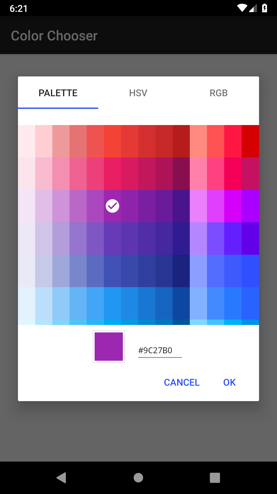
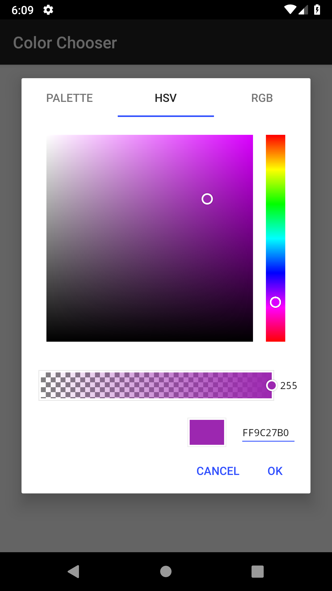
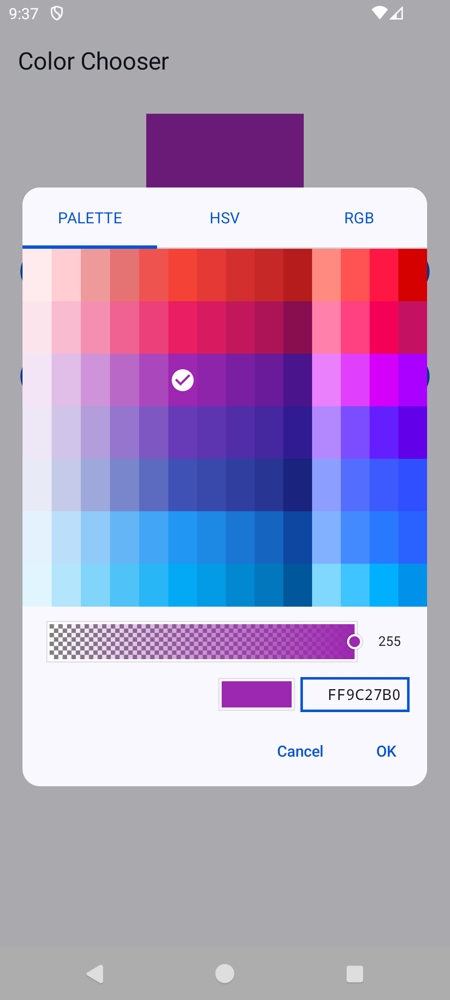
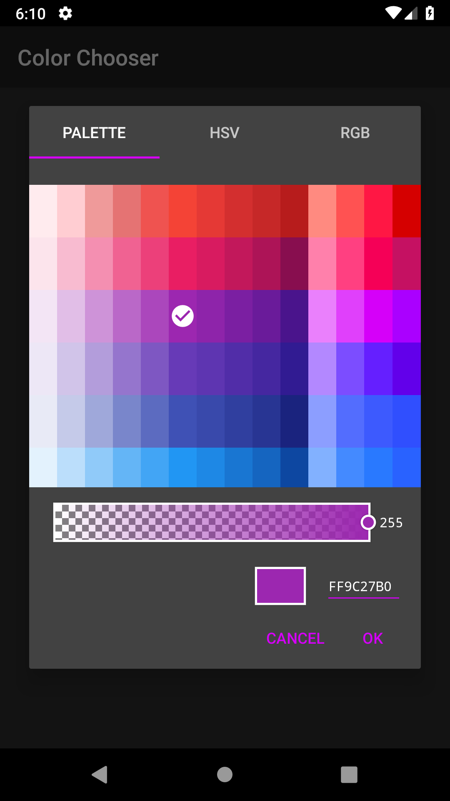
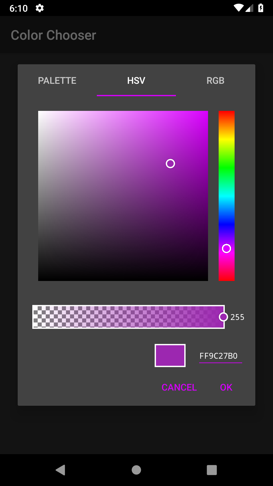
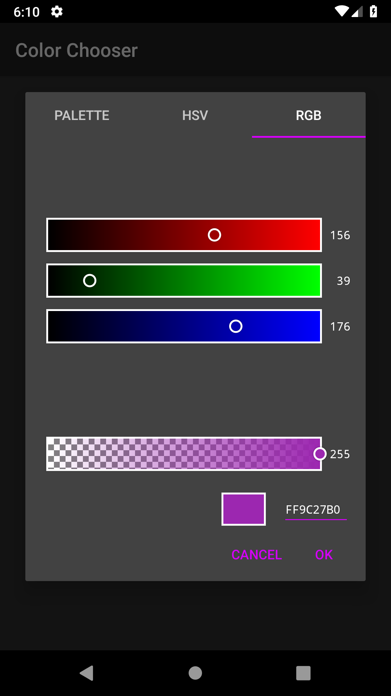
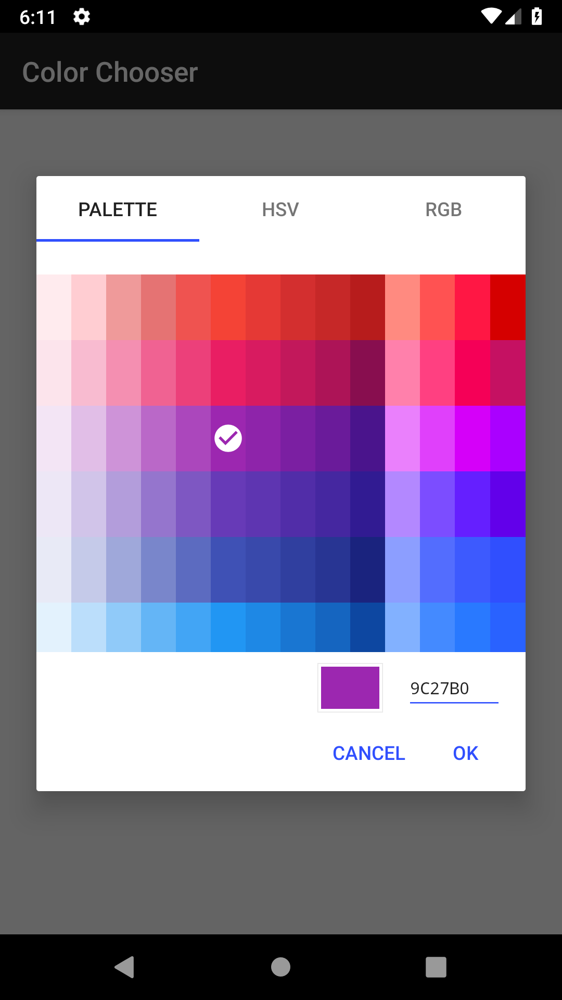
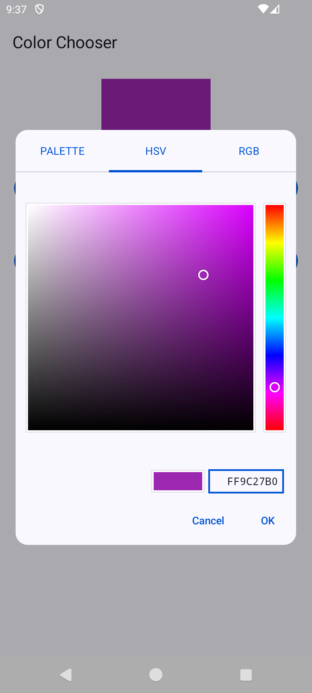
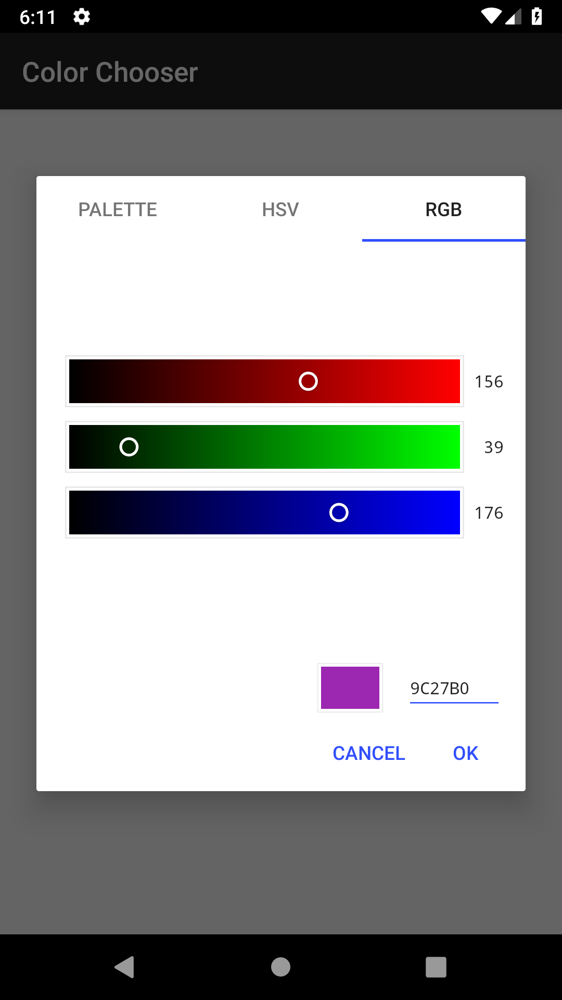

# color chooser

[](./LICENSE)
[](https://github.com/ohmae/color-chooser/releases)
[](https://github.com/ohmae/color-chooser/issues)
[](https://github.com/ohmae/color-chooser/issues?q=is%3Aissue+is%3Aclosed)
[](https://search.maven.org/artifact/net.mm2d.color-chooser/color-chooser)

## ScreenShots

||||
|:-:|:-:|:-:|
||||
||||

## How to use

### Jetpack Compose

latest version: 

```gradle
dependencies {
    implementation 'net.mm2d.color-chooser:color-chooser-compose:<version>'
}
```

```kotlin
var show by rememberSaveable { mutableStateOf(false) }

...

if (!show) return
ColorChooserDialog(
    initialColor = Color(color),
    onDismissRequest = {
        show = false
        // dismiss the dialog 
    },
    onChooseColor = { color ->
        // handle chosen color
    },
)
```

### View-base app

latest version: 

```gradle
dependencies {
    implementation 'net.mm2d.color-chooser:color-chooser:<version>'
}
```

Register the listener to receive the result.
Write the following process in onViewCreated of Fragment or onCreate of Activity.

```kotlin
ColorChooserDialog.registerListener(REQUEST_KEY, this) {
    // it is selected color as @ColorInt
}
```

To show dialog. On `FragmentActivity` or `Fragment`

```kotlin
ColorChooserDialog.show(
    this,         // Fragment or FragmentActivity
    REQUEST_KEY,  // request key for receive result
    initialColor, // initial color, optional, default #FFFFFF
    true,         // need for alpha, optional, default false
    TAB_RGB       // initial tab, TAB_PALETTE/TAB_HSV/TAB_RGB, optional, default  TAB_PALETTE
)
```

*The style of implementing a callback interface in Activity and Fragment has been deprecated.*

Please see [Sample code](sample/src/main/java/net/mm2d/color/chooser/sample/MainActivity.kt) for detail.

## API Document

- [dokka](https://ohmae.github.io/color-chooser/dokka/)

## Dependent OSS

- [color-chooser](./chooser/dependencies/releaseRuntimeClasspath.txt)
- [color-chooser-compose](./chooser-compose/dependencies/releaseRuntimeClasspath.txt)

## Author

大前 良介 (OHMAE Ryosuke)
http://www.mm2d.net/

## License

[MIT License](./LICENSE)
