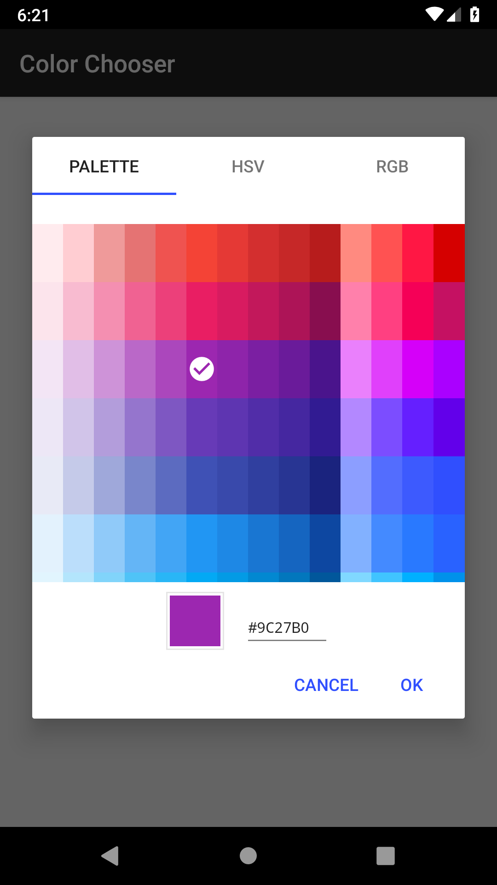
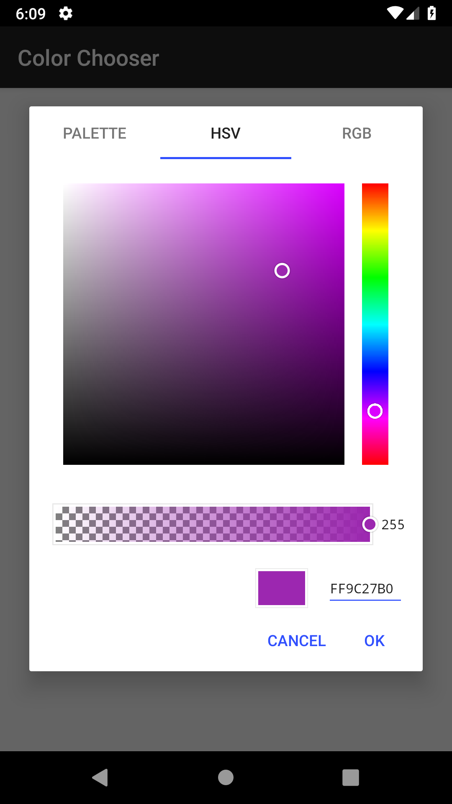
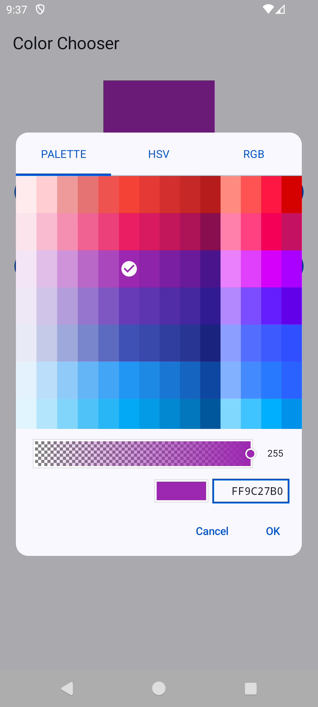
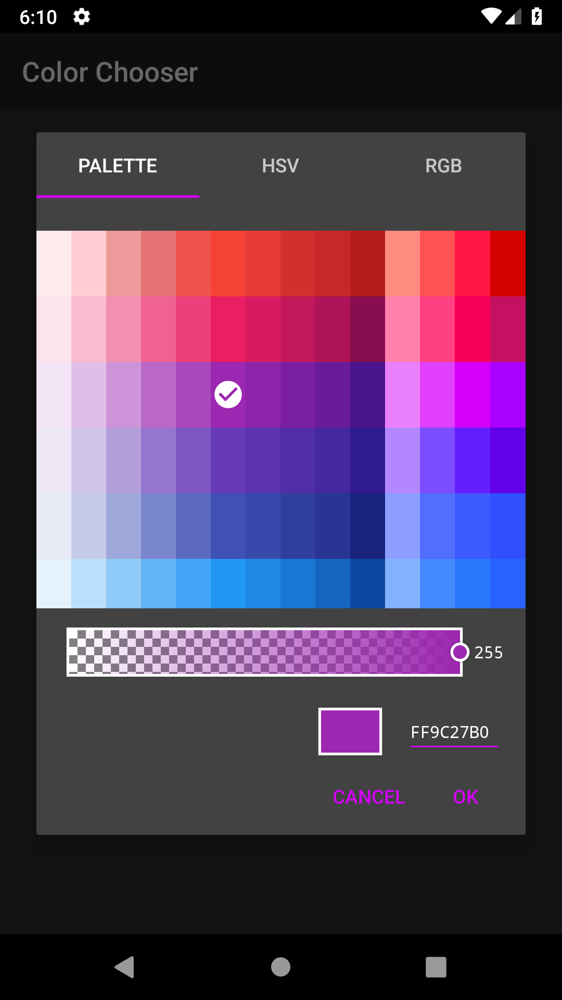
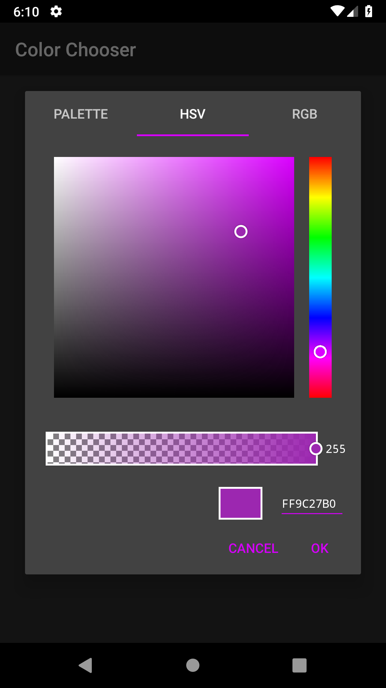
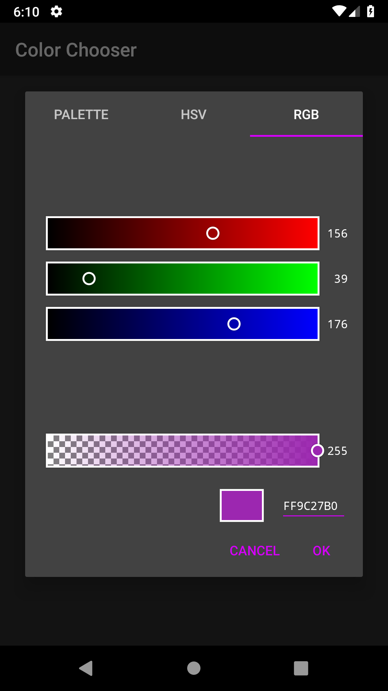
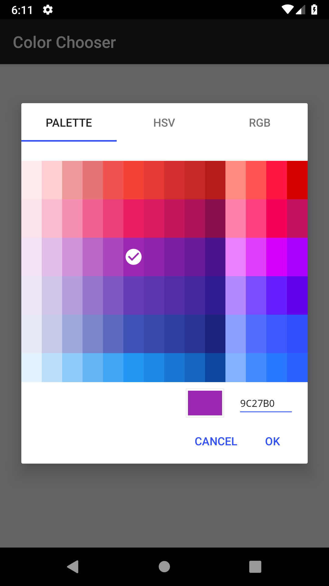
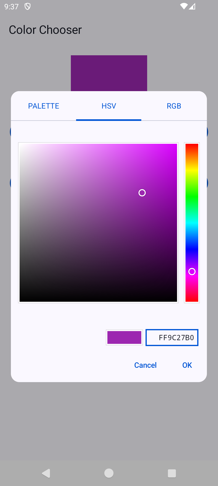
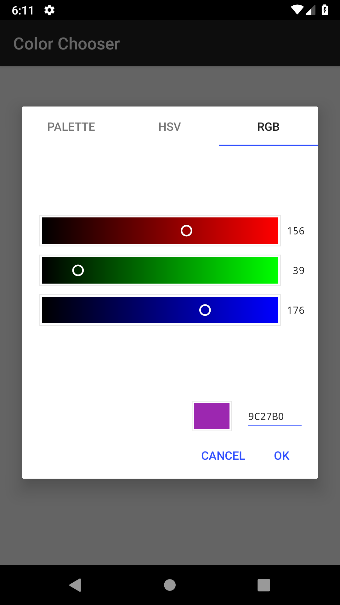

# color chooser

[](./LICENSE)
[](https://github.com/ohmae/color-chooser/releases)
[](https://github.com/ohmae/color-chooser/issues)
[](https://github.com/ohmae/color-chooser/issues?q=is%3Aissue+is%3Aclosed)
[](https://search.maven.org/artifact/net.mm2d.color-chooser/color-chooser)

## ScreenShots

||||
|:-:|:-:|:-:|
||||
||||

## How to use

### Jetpack Compose

latest version: 

```gradle
dependencies {
    implementation 'net.mm2d.color-chooser:color-chooser-compose:<version>'
}
```

#### Dialog

To show a modal color chooser dialog, use `ColorChooserDialog`:

```kotlin
var showDialog by rememberSaveable { mutableStateOf(false) }
var selectedColor by rememberSaveable { mutableStateOf(Color.Blue) }

if (showDialog) {
    ColorChooserDialog(
        onDismissRequest = { showDialog = false },
        onConfirm = {
            selectedColor = it
            showDialog = false
        },
        initialColor = selectedColor,
        withAlpha = true,
    )
}
```

- Default "OK" and "Cancel" buttons are provided. "OK" calls `onConfirm` only; close the dialog
  in that callback. "Cancel" and platform dismissal call `onDismissRequest`.
- By default, only palettes scroll vertically. For very short dialogs, set `scrollEntireContent = true`
  to scroll the preview and controls together; the HSV square is reduced so the user can scroll back
  without dragging on its two-axis editing surface.
- Custom buttons can be provided via `confirmButton: @Composable (selectedColor: Color) -> Unit` and
  `dismissButton: @Composable (() -> Unit)?` slots.
- Optional `onColorChanged: ((Color) -> Unit)?` can be used to observe real-time color changes during editing.
- Tabs can be configured with `choosers` and `initialChooser` using `Chooser` (`Chooser.M2`, `Chooser.HSV`,
  `Chooser.RGB`, `Chooser.M3`).

#### Screen / Embed

Use `ColorChooserScreen` inside your screen or a dialog with a bounded width and height.
It reports edits through `onColorChanged`; the caller owns confirmation and cancellation.

```kotlin
@Composable
fun ColorPickerScreen(
    initialColor: Color,
    onConfirm: (Color) -> Unit,
    onCancel: () -> Unit,
    withAlpha: Boolean = true,
) {
    var selectedArgb by rememberSaveable(initialColor) {
        mutableIntStateOf(initialColor.toArgb())
    }
    if (!withAlpha && (selectedArgb ushr 24) != 255) {
        selectedArgb = selectedArgb or (0xFF shl 24)
    }

    Column(Modifier.fillMaxSize().padding(16.dp)) {
        ColorChooserScreen(
            color = Color(selectedArgb),
            initialColor = initialColor,
            onColorChanged = { selectedArgb = it.toArgb() },
            withAlpha = withAlpha,
            modifier = Modifier.fillMaxWidth().weight(1f),
        )
        Row {
            TextButton(onClick = onCancel) { Text("Cancel") }
            TextButton(onClick = { onConfirm(Color(selectedArgb)) }) { Text("OK") }
        }
    }
}
```

- Inputs are converted to **8-bit sRGB** for editing and previews; callbacks return the same
  representation. Wide-gamut inputs are converted, not interpreted as sRGB components.
  `Color.Unspecified` is not supported.
- `withAlpha = false` discards transparency: previews and results are opaque, even when confirmed
  without editing. Turning alpha back on during editing starts with full opacity.
- The `color` overload lets the caller own the edited color, as in the confirmation example above.
  Save that color to retain the pending result across activity/process recreation.
- The `initialColor` overload owns and saves its edited color internally. Keep `initialColor` as the
  session's starting color; changing it resets the edited color. Restoration does not invoke `onColorChanged`.
- Both overloads preserve the selected tab and HSV editing coordinates across activity/process recreation
  and tab changes, including hue at gray and saturation at black.
- When embedding in a `verticalScroll` or `LazyColumn` without a fixed item height, pass
  `disableInnerScroll = true`. Palette horizontal scrolling still requires a bounded width.
- RGB, opacity and hue bars update on tap release or horizontal drag; vertical swipes can scroll
  the parent without changing the color. The saturation/brightness plane uses both drag directions for editing.
- Color ramps keep a left-to-right direction in RTL layouts. RGB, opacity and hue support
  accessibility value adjustment, arrow keys and Home/End. The saturation/brightness area supports
  accessibility increase/decrease actions and arrow keys (left/right for saturation, up/down for brightness).

`ColorChooserView`, the legacy `ColorChooserDialog` (accepting `Tab`), and `Tab` are deprecated but remain available for
compatibility.
The legacy dialog retains its original behavior: confirming calls `onChooseColor` and then `onDismissRequest`.
Migrate tab selections to `Chooser` (`Tab.PALETTE` becomes `Chooser.M2`) and use `ColorChooserScreen` or the modern
`ColorChooserDialog`.
The old `titleContentColor` maps to both `selectedTabContentColor` and `unselectedTabContentColor`
in `ColorChooserDefaults.colors()`. The legacy `ColorChooserView` reflects external `colorState`
updates and normalizes that state to the same sRGB/alpha rules.

See the [Compose sample](sample-compose/src/main/kotlin/net/mm2d/color/chooser/sample/compose/MainScreen.kt)
for dialog usage,
and [sample screen](sample-compose/src/main/kotlin/net/mm2d/color/chooser/sample/compose/ChooserScreen.kt)
for confirmation, cancellation and saved-state handling with `ColorChooserScreen`.

### View-base app

latest version: 

```gradle
dependencies {
    implementation 'net.mm2d.color-chooser:color-chooser:<version>'
}
```

Register the listener to receive the result.
Write the following process in onViewCreated of Fragment or onCreate of Activity.

```kotlin
ColorChooserDialog.registerListener(REQUEST_KEY, this) {
    // it is selected color as @ColorInt
}
```

To show dialog. On `FragmentActivity` or `Fragment`

```kotlin
ColorChooserDialog.show(
    this,         // Fragment or FragmentActivity
    REQUEST_KEY,  // request key for receive result
    initialColor, // initial color, optional, default #FFFFFF
    true,         // need for alpha, optional, default false
    TAB_RGB       // initial tab, TAB_PALETTE/TAB_HSV/TAB_RGB, optional, default  TAB_PALETTE
)
```

*The style of implementing a callback interface in Activity and Fragment has been deprecated.*

Please see [Sample code](sample/src/main/java/net/mm2d/color/chooser/sample/MainActivity.kt) for detail.

## API Document

- [dokka](https://ohmae.github.io/color-chooser/dokka/)

## Dependent OSS

- [color-chooser](./chooser/dependencies/releaseRuntimeClasspath.txt)
- [color-chooser-compose](./chooser-compose/dependencies/releaseRuntimeClasspath.txt)

## Author

大前 良介 (OHMAE Ryosuke)
http://www.mm2d.net/

## License

[MIT License](./LICENSE)
