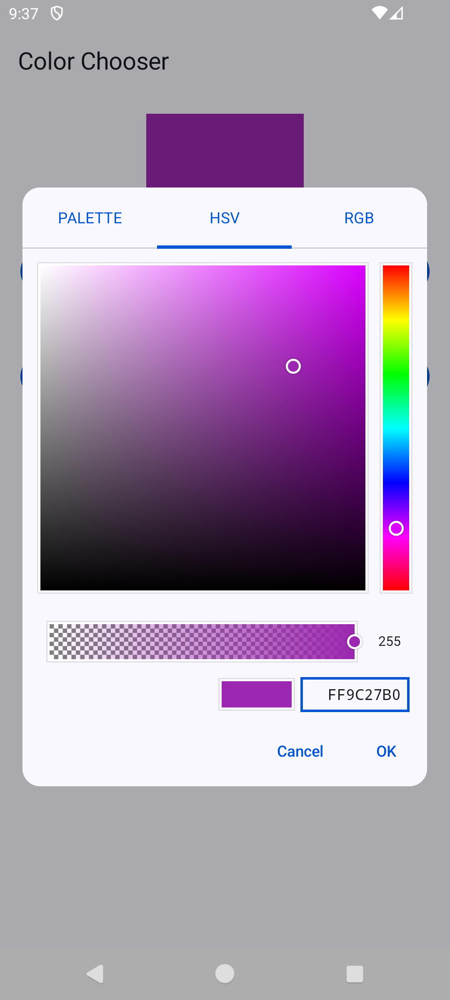
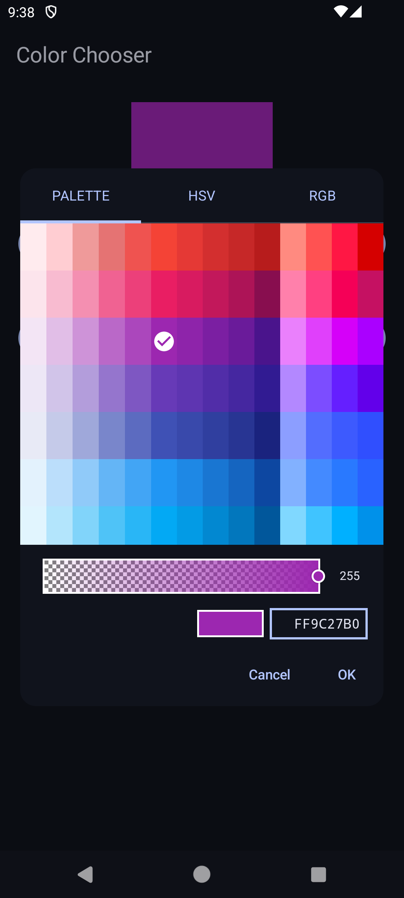
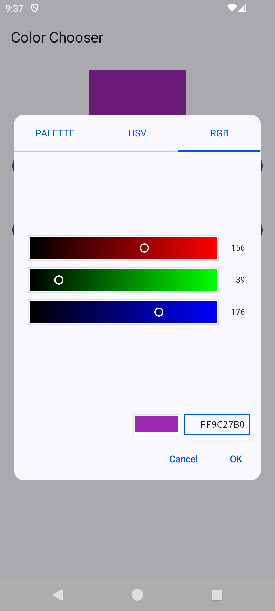

# color chooser

[](./LICENSE)
[](https://github.com/ohmae/color-chooser/releases)
[](https://github.com/ohmae/color-chooser/issues)
[](https://github.com/ohmae/color-chooser/issues?q=is%3Aissue+is%3Aclosed)
[](https://bintray.com/ohmae/maven/net.mm2d.color-chooser)
[](https://bintray.com/ohmae/maven/net.mm2d.color-chooser)

## ScreenShots

||||
|:-:|:-:|:-:|
||||
||||

## How to use

*jCenter will close in May. I am currently considering migrating to another hosting service. Please wait.*

Download from jCenter. Add dependencies, such as the following.

latest version: [](https://bintray.com/ohmae/maven/net.mm2d.color-chooser)

```gradle
repositories {
    jcenter()
}
dependencies {
    implementation 'net.mm2d:color-chooser:<version>'
}
```

To show dialog. On `FragmentActivity` or `Fragment`

```kotlin
ColorChooserDialog.show(
    this,         // Fragment or FragmentActivity
    REQUEST_CODE, // request code for receive result, optional, default 0
    initialColor, // initial color, optional, default #FFFFFF
    true,         // need for alpha, optional, default false
    TAB_RGB       // initial tab, TAB_PALETTE/TAB_HSV/TAB_RGB, optional, default  TAB_PALETTE
)
```

To receive result. Implement `ColorChooserDialog.Callback` to `Activity` or `Fragment`

```kotlin
class MainActivity : AppCompatActivity(), ColorChooserDialog.Callback {
    override fun onColorChooserResult(requestCode: Int, resultCode: Int, color: Int) {
        if (requestCode != REQUEST_CODE || resultCode != Activity.RESULT_OK) return
        // use color
    }
}
```

Please see [Sample code](sample/src/main/java/net/mm2d/color/chooser/sample/MainActivity.kt) for detail.

## API Document

- [dokka](https://ohmae.github.io/color-chooser/dokka/color-chooser/index.html)

## Dependent OSS

### color-chooser

- [Kotlin](https://kotlinlang.org/)
- [Android Jetpack](https://developer.android.com/jetpack/)
  - androidx.appcompat:appcompat
  - androidx.core:core-ktx
  - com.google.android.material:material

### sample app

- [Kotlin](https://kotlinlang.org/)
- [Android Jetpack](https://developer.android.com/jetpack/)
  - androidx.appcompat:appcompat
  - androidx.constraintlayout:constraintlayout
- [LeakCanary](https://github.com/square/leakcanary)

## Author

大前 良介 (OHMAE Ryosuke)
http://www.mm2d.net/

## License

[MIT License](./LICENSE)
