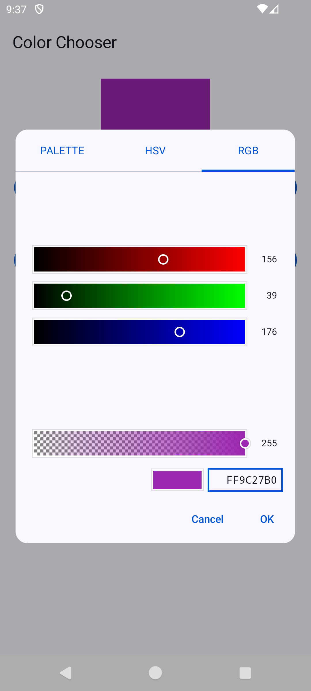
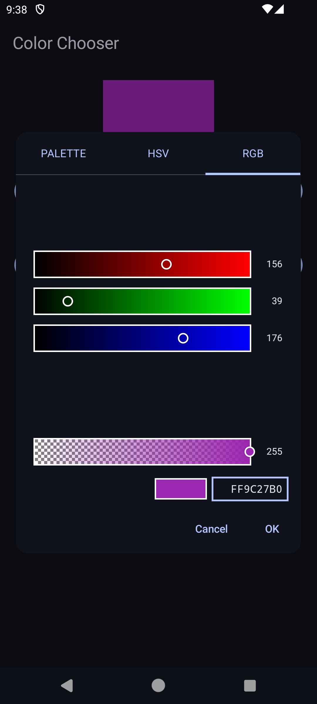

# color chooser
[](./LICENSE)
[](https://github.com/ohmae/color-chooser/releases)
[](https://github.com/ohmae/color-chooser/issues)
[](https://github.com/ohmae/color-chooser/issues?q=is%3Aissue+is%3Aclosed)
[](https://bintray.com/ohmae/maven/net.mm2d.color-chooser)
[](https://bintray.com/ohmae/maven/net.mm2d.color-chooser)

## ScreenShots

||||
|:-:|:-:|:-:|
||||

## How to use

You can download this library from jCenter.
```gradle
repositories {
    jcenter()
}
```

Add dependencies, as following.
```gradle
dependencies {
    implementation 'net.mm2d:color-chooser:0.0.2'
}
```

To show dialog. On `FragmentActivity` or `Fragment`

```kotlin
ColorChooserDialog.show(this, REQUEST_CODE, initialColor)
```

To receive result. Implement `ColorChooserDialog.Callback` to `Activity` or `Fragment` 

```kotlin
class MainActivity : AppCompatActivity(), ColorChooserDialog.Callback {
    override fun onColorChooserResult(requestCode: Int, resultCode: Int, color: Int) {
        if (requestCode != REQUEST_CODE || resultCode != Activity.RESULT_OK) return
        // use color
    }
}
```

Please see [Sample code](sample/src/main/java/net/mm2d/color/chooser/sample/MainActivity.kt) for detail.

## Author
大前 良介 (OHMAE Ryosuke)
http://www.mm2d.net/

## License
[MIT License](./LICENSE)
